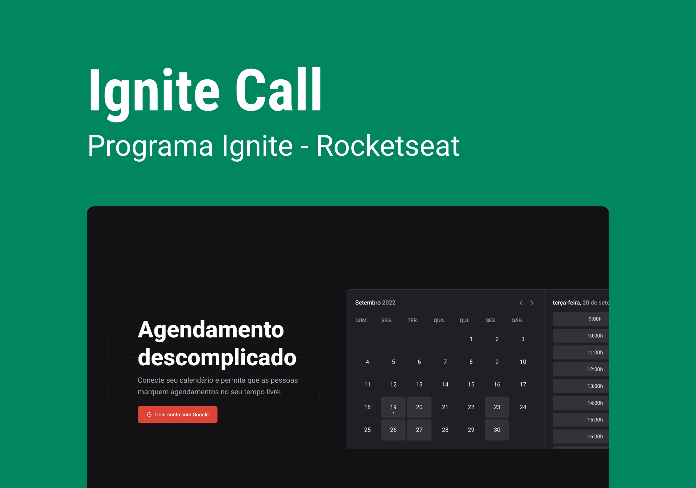

# Projeto de Design System criado através das aulas assistidas na trilha de Reactjs, Rocketseat 

## 💻 Projeto

Projeto exclusivo da trilha de Reactjs atualizada recentemente pela Rocketseat.

Este projeto será utilizado como uma lib de components estilizados para o próximo projeto da trilha, chamado Ignite Call.

## 🚀 Tecnologias

Esse projeto foi desenvolvido com as seguintes tecnologias:

- Storybook
- Reactjs
- Typescript
- Radix-ui (componentes de acessibilidade)

Publicação e manutenção da lib configurando changesets. Criando fluxo de CI/CD dos pacotes NPM.

Para vizualizar o pacote criado: [DESSE LINK](https://www.npmjs.com/package/@felipecruz-ignite-ui/tokens).

